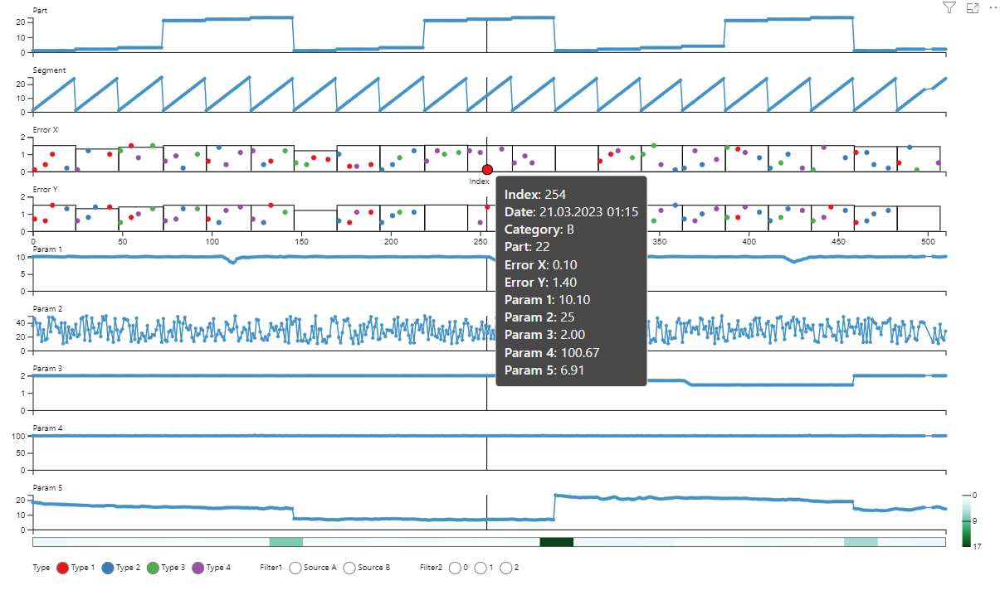
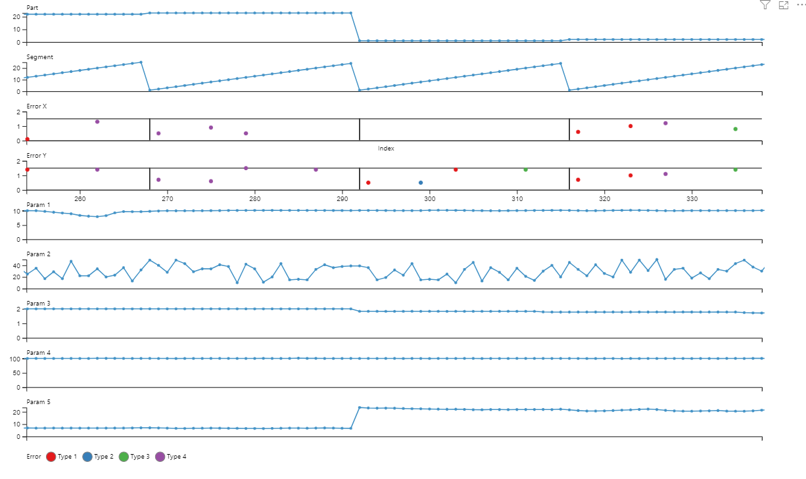

# Multiple Stacked Charts
Multiple stacked charts is a custom visual for Microsoft Power BI. 

<iframe width="1268" height="713" src="https://www.youtube.com/embed/aiKneeHipT0" title="Multiple Stacked Charts Visualization / Power BI Visualization" frameborder="0" allow="accelerometer; autoplay; clipboard-write; encrypted-media; gyroscope; picture-in-picture; web-share" allowfullscreen></iframe>

[AppSource](https://appsource.microsoft.com/en-us/product/power-bi-visuals/pro2futuregmbh1670847158359.multiple_stacked_charts?exp=ubp8)

## Key Features
 - Comparison of multiple measures in one visual
 - Vertical ruler to highlight current X-position in all plots
 - Custom tooltip information that supports text, number and date columns
 - Data points can be colored differently based on categorical data
 - Filtering colored data points by categorical filters
 - Heatmap support for analyzing variations in data
 - Zooming and panning
 - Support for rectangle plot overlays for visualizing segments in data
 - X-axis break and break lines can be toggled
 - Customization of axis labels and ticks, data colors, plot titles, minimum value, maximum value and heatmap for each plot
 - Colored background based on status column possible

