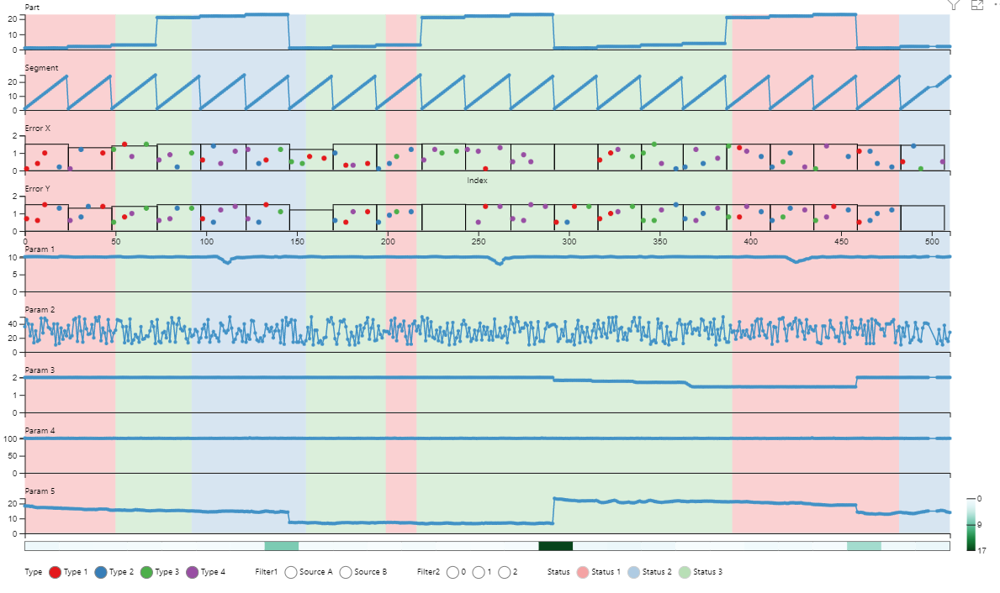

# Multiple Stacked Charts
Multiple stacked charts is a custom visual for Microsoft Power BI. 

## Key Features
 - Comparison of multiple measures in one visual
 - Vertical ruler to highlight current X-position in all plots
 - Custom tooltip information that supports text, number and date columns
 - Data points can be colored differently based on categorical data
 - Heatmap support for analyzing variations in data
 - Zooming and panning
 - Categorical filters
 - Support for rectangle plot overlays for visualizing segments in data
 - X-axis break and break lines can be toggled
 - Customization of axis labels and ticks, data colors, plot titles, minimum value, maximum value and heatmap for each plot

